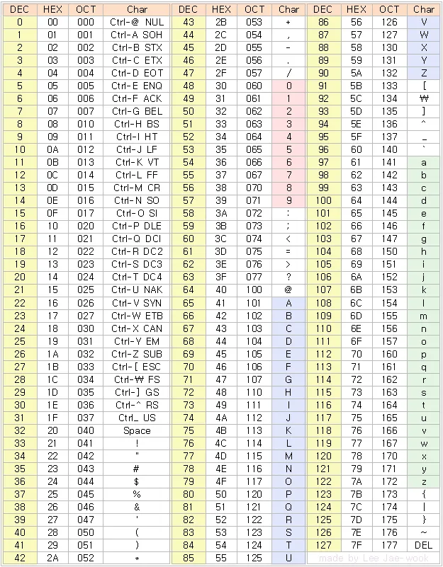

## 백준 10809 문제입니다.

### [10809번: 알파벳 찾기](https://www.acmicpc.net/problem/10809)

---
- 문제 분석
  1. 입력 값, 출력 값

    ```sql
    Input
    - 첫째 줄에 단어 S 
    - S < 100
    Output: 알파벳이 처음으로 등장한 인덱스 배열
    ```

  1. 문자열의 길이 만큼 반복
  2. 알파벳 배열에 유니코드로 계산 해서 존재하면 idx 넣기
---
- 코드 구현

    ```python
    string = "baekjoon"
    alphabet_array = [-1] * 26
    
    for i in range(len(string)):
        for j in range(26):
            array_idx = ord(string[i]) - ord('a')
            continue
        if alphabet_array[array_idx] == -1:
            alphabet_array[array_idx] = i
    
    print (alphabet_array)
    ```
---

- 배운 것

  동민님이 알려주신 문자에 해당되는 유니코드 정수를 반환 하는 `ord` 을 배웠 습니다. 덕분에 더 기억이 잘 나는 것 같습니다.


  ### `ord` : 해당 문자를 유니코드 정수를 반환

    ```python
    ord('a'): 97
    ord('z'): 122
    ord('A'): 65
    ```

  
    
  ---