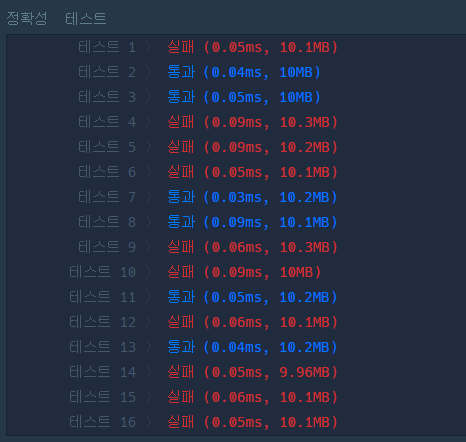

- 문제풀이: [프로그래머스:최빈값](https://school.programmers.co.kr/learn/courses/30/lessons/120812)
    
    - 문제 분석
        1. 입력 값, 출력 값
        
        ```python
        Input
        0 < array의 길이 < 100
        0 ≤ array의 원소 < 1000
        Output
        배열에서 가장 많이 나온 수
        ```
        
        2. 빈도 수를 저장하는 배열을 따로 생성
        3. array를 한번 돌려서 각각의 수에 해당되는 곳, 빈도 수 배열에 +1
        4. 최빈값이 여러 개 일 경우 -1
        
    - 코드 구현
        - 첫 번째 시도(❌)
        
        ```python
        def solution(array):
            answer = 0
            count_max = [0] * 1000
            for i in array:
                count_max[i] += 1
            if count_max.count(max(count_max)) > 1:
                return -1
            return count[max(count_max)]
        ```
        
        
        
        [0, 0, 0……] 천 개를 만들어서 1이 들어오면 [1, 0, 0….] array 길이 만큼 실행을 하고 만약, 최빈값에 해당하는 수가 여러 개 일 경우에는 -1 그것이 아니라면 최댓값에 해당되는 것을 출력
        
        - 두 번째 시도(⭕)
        
        수정 사항: list.index(n)을 이용해서 return을 했습니다.
        
        역시나 **python이 미숙한 문제 발생…이였습니다.**
        
        ```python
        def solution(array):
            answer = 0
            count_max = [0] * 1000
            for i in array:
                count_max[i] += 1
            if count_max.count(max(count_max)) > 1:
                return -1
            return count_max.index(max(count_max))
        ```
        
    - 배운 것
        
        #### `index` : 리스트의 특정 원소 찾기
        
        ```python
        a = [1, 2, 3, 4, 5, 6]
        a.index(2) // 1
        ```